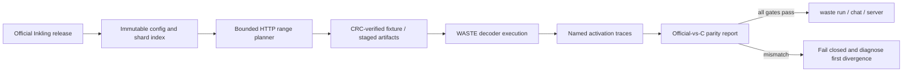
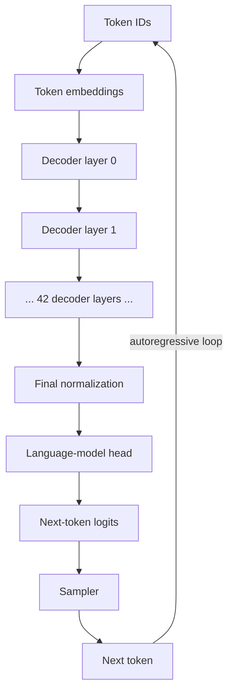
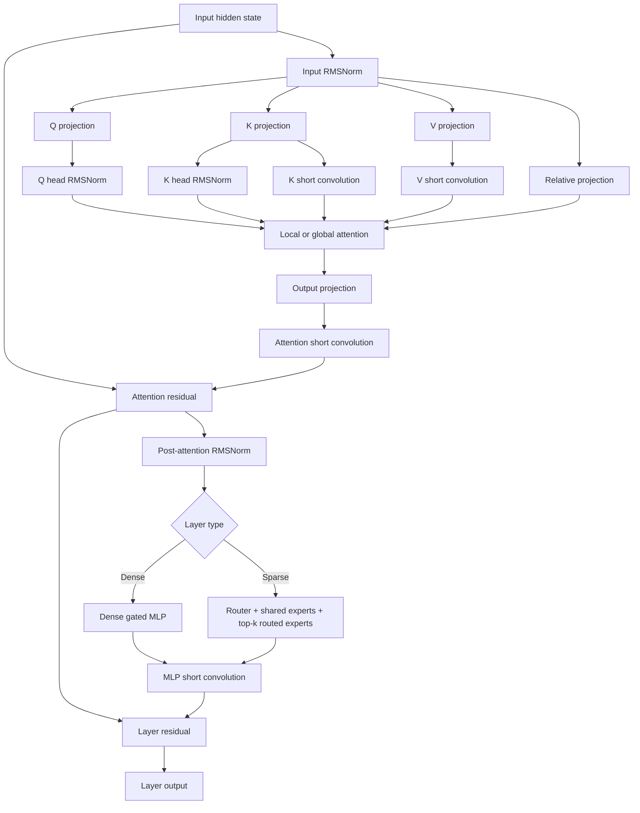
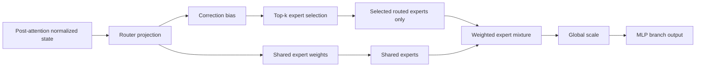
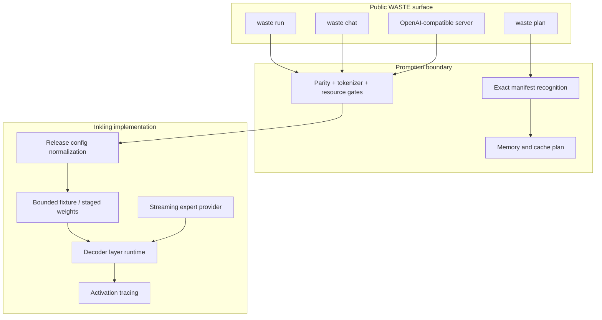

# WASTE × Inkling-Small

<p align="center">
  <strong>A bounded, evidence-first path to running a 276B sparse Transformer in WASTE.</strong>
</p>

<p align="center">
  
  
  
  
</p>

> [!IMPORTANT]
> `waste plan` supports Inkling geometry today. Public loading, generation, chat,
> and serving remain intentionally disabled until official-weight numerical
> parity covers the decoder and logits, tokenizer/chat-template parity is
> recorded, and the measured resource gates pass.

This repository develops Inkling-Small support for
[`sqliteai/waste`](https://github.com/sqliteai/waste): a portable C inference
runtime with explicit memory planning, fail-closed model recognition, and a
normal path to CLI and OpenAI-compatible serving.

The objective is not to make Inkling “appear to run.” The objective is to make
every architectural and numerical claim reviewable.

---

## The mission

Inkling-Small is a **42-layer decoder-only sparse Transformer** with roughly
**276B total parameters** and about **12B active parameters per token**. It
combines local and global attention, relative-position features, short
convolutions, dense feed-forward layers, and routed Mixture-of-Experts layers.

WASTE must therefore solve five distinct problems:

1. recognize the release and bind its geometry without guessing;
2. plan storage and RAM before touching hundreds of gigabytes of weights;
3. stream the selected tensors and experts without expanding the full model;
4. reproduce the official BF16 decoder semantics;
5. expose the model through ordinary WASTE APIs only after the evidence is green.



---

## Full model architecture

At the model level, Inkling follows the familiar autoregressive decoder shape,
but each decoder block may use a dense MLP or a sparse routed expert bank.



### One Inkling decoder layer



### Sparse expert path



The WASTE path never needs to allocate a zero-filled 256-expert resident bank.
Selected experts are served through the runtime’s `expert_get` callback, keeping
memory proportional to the experts actually required by the evidence fixture.

---

## How WASTE applies to Inkling

WASTE already supplies the operational shell a production model needs:

- cgroup-aware usable-RAM detection;
- explicit preflight memory planning;
- portable C build and server integration;
- cancellation, error propagation, and normal public APIs;
- a container format that can fail closed before loading tensors.

The Inkling work adds a model-specific architecture layer without creating a
second public runtime.



Today only the planning path crosses the public boundary. Execution APIs return
`WASTE_E_UNSUPPORTED` for Inkling until promotion gates are satisfied.

---

## Current status

### Landed on `main`

| Area | Evidence |
| --- | --- |
| Exact model recognition | Official Inkling-Small package is recognized; mislabeled or incomplete manifests are refused |
| Public memory planning | `waste_plan_memory()` and `waste plan` calculate the model geometry without loading weights |
| Config schema resolution | Release `dense_intermediate_size=16384` and routed `intermediate_size=2048` are translated safely into the Transformers schema |
| Synthetic architecture parity | Dense/local and sparse/global decoder layers match `InklingDecoderLayer` to float32 epsilon on bounded synthetic fixtures |
| Remote bounded extraction | Immutable HTTP range reads, source-hash binding, CRC checks, path validation, and strict byte limits |
| Official router evidence | Eight deterministic BF16 states record exact `(expert_id, weight)` pairs for layers 2 and 5 |
| Evidence-selected fixture plan | 175 entries, 3,842,395,658 payload bytes, 52 metadata/range requests, 25 touched shards |
| Sparse memory bound | Selected experts are supplied through `expert_get`; no full 256-expert float32 bank expansion |
| Stateful sparse-layer evidence | Layer 2 is BF16-exact through routed/shared weights, MoE output, MLP branch, and final residual at all eight tested positions on the named Linux AVX2 profile — [docs/BF16-EVIDENCE.md](docs/BF16-EVIDENCE.md) |
| Decode cost model | Exact per-token geometry, the expert cache measured against upstream's real `ecache.c`, and a throughput projection calibrated to reproduce K3's measured decode — [docs/THROUGHPUT.md](docs/THROUGHPUT.md) |
| Public container loading | `waste_open` builds the Inkling geometry, reads `trunk.bin` through upstream's own loader, and binds every canonical tensor — quantized matrices non-resident, through WASTE's optimized kernel. `waste info` describes the container it opened. Format: [docs/INKLING-CONTAINER.md](docs/INKLING-CONTAINER.md) |
| Plan/load agreement | The planned resident trunk equals the resident set the load produces, to the byte, on containers written at f32, Q8G and Q4G |
| Chat API surface | `/v1/chat/completions` served over the staged runtime, streaming and not, run end to end; public generation still refused |

The committed official selection contains **33 unique routed experts for layer
2** and **26 unique routed experts for layer 5** across the eight deterministic
positions.

### Measured official-weight frontier

The official 532 GB checkpoint has **not** been run end to end, but bounded
official-weight execution has now crossed several important gates:

- immutable bounded fixtures have been downloaded and CRC-verified;
- official and C execution completed for representative dense, local-sparse,
  and global-sparse layers;
- the retained arithmetic investigation identified explicit BF16 completion
  points for normalization, attention, residuals, expert arithmetic, routing,
  and the router denominator;
- PR #57 composed those policies through the full layer-2 sparse-MLP ladder for
  eight source-bound positions: all five recorded stages were BF16-exact, no
  first mismatch was found, and 240 backend calls were retained;
- that success is scoped to Torch 2.13.0, one compute thread, AVX2 dispatch,
  and the recorded AMD EPYC 7763 host class. It is not a platform-independent
  theorem or a full-decoder result;
- portable deterministic WASTE routing remains distinct from exact
  profile-bound official routing at ambiguous BF16 cutoffs.

### Still in progress

| Gate | Current boundary |
| --- | --- |
| Reference-profile stability | Position-zero complete-layer evidence passed 4/5 unchanged runs; the cause of the one failure is still unresolved and the same-host backend matrix remains the next measurement |
| Production BF16 execution | The proven policy still lives in evidence-only transforms and adapters; checked-in production C remains F32 and public execution remains refused |
| Coverage beyond local sparse layer 2 | Stateful dense layer 0, global sparse layer 5, cross-layer decoder continuity, final normalization, and logits are not yet established |
| Tokenizer and chat-template parity | Not yet promoted into the release gate |
| Quantized model quality | Q8/Q4/VQ tolerances, throughput, conversion time, and memory floors still require official measurement |
| Public expert cache and generation | The loader is promoted and the expert banks are validated but not opened; `waste_model_step`, `waste_model_prefill`, `waste_eval` and `waste_generate` refuse an Inkling model, and the suite asserts that refusal |
| Public container writer | Nothing yet converts a checkpoint into a public Inkling container; the format is specified and exercised, and the only containers that exist are synthetic |
| Native Windows and operator validation | Final release and serving gate |

---

## What a decoded token costs

Every gate above asks whether this port computes the right thing. None asked
how fast. **[docs/THROUGHPUT.md](docs/THROUGHPUT.md)** answers the part that is
knowable without running the whole checkpoint.

| | K3 | Inkling-Small | K3 / Inkling |
| --- | ---: | ---: | ---: |
| bytes read per decoded token | 17.01 GiB | **2.11 GiB** | **8.0x** |
| RAM for the cache resolver's first rung | 50.6 GiB | **7.1 GiB** | 7.1x |
| RAM for its maximum | 89.5 GiB | **11.9 GiB** | 7.5x |

WASTE's budget resolver steps in whole multiples of one token's working set,
because upstream measured that a demand-only cache below it hits *exactly
zero*. That quantum is 17 GiB on K3 and 2.11 GiB here, so **an 8 GiB machine
clears a full working set and a 16 GiB machine reaches the largest cache the
engine will ever ask for**.

The geometry is exact. The cache is measured, not modelled —
`inkling_cache_sim.c` links upstream's real `ecache.c` and runs the shipping
LFRU, reproduces upstream's published curve conservatively (mean -9.9pp), and
independently reproduces its sharpest finding: a cache below one token's
working set hits exactly zero. Throughput is a projection, labelled as one in
every line it prints, and calibrated to reproduce K3's own measured decode
(0.61 tok/s against a measured 0.56-0.63) before being applied here.

**The largest available win is a defect in this port.** `inkling_wexp.c`
expands every expert to 100.7 MB of F32 before multiplying it; upstream's
`vq_matvec` never expands one. Measured 4.5-5.9x in isolation and 18.3x less
DRAM traffic — 60.0 GiB/token down to 3.28. Tempered by upstream's own VQ4P
result, where a 3.88x isolation win became 1.09-1.18x in the engine for
reasons they could not account for; expect a range, not the headline.

## Talking to it

`tools/inkling_serve.py` serves an OpenAI-compatible chat endpoint over the
staged runtime, and has been run end to end rather than mocked: HTTP in, C
forward pass, sampled tokens, JSON out, SSE streaming included.

```sh
python3 tools/inkling_serve.py --stage STAGE_DIR --i-know-the-weights-are-synthetic
curl -s localhost:8000/v1/chat/completions -H 'Content-Type: application/json' \
  -d '{"messages":[{"role":"user","content":"hi"}],"max_tokens":16}'
```

Every response carries `x-waste-provenance` — today `weights=synthetic
tokenizer=fallback` — so a caller cannot mistake staged synthetic output for
the model's. The server first requires the C runtime's verified official
Inkling-Small profile gate; only the explicit, deliberately tedious flag
permits reopening a stage as synthetic.

It drives the **converter-private** path on purpose. Upstream's `serve/`
reaches the engine only through `waste_open`, `waste_tokenize` and the step
API. The loader dispatch has now landed; when the step does too, `serve/`
becomes the chat server unchanged and this becomes redundant.
That is the intended outcome, and it is why it implements the same wire format
rather than a nicer one.

---

## Evidence roadmap


The finish line is intentionally ordinary:

```text
waste plan model.waste
waste run model.waste
waste chat model.waste
OpenAI-compatible server
```

No Inkling-only executable, no hidden memory budget, and no separate serving
stack.

---

## Evidence artifacts

| Artifact | Purpose |
| --- | --- |
| [`docs/CONFIG-SCHEMA-RESOLUTION.md`](docs/CONFIG-SCHEMA-RESOLUTION.md) | Authoritative release geometry and schema translation |
| [`docs/REMOTE-FIXTURES.md`](docs/REMOTE-FIXTURES.md) | Strict HTTP range extraction and safety contract |
| [`docs/OFFICIAL-ROUTER-SELECTION.json`](docs/OFFICIAL-ROUTER-SELECTION.json) | Exact official routed expert/weight pairs for deterministic inputs |
| [`docs/OFFICIAL-FIXTURE-PLAN.json`](docs/OFFICIAL-FIXTURE-PLAN.json) | Hash-bound 3.58 GiB evidence fixture plan |
| [`docs/BF16-EVIDENCE.md`](docs/BF16-EVIDENCE.md) | Consolidated arithmetic conclusions, authoritative runs, and exact scope |
| [`docs/INKLING-REFERENCE-PROFILES.md`](docs/INKLING-REFERENCE-PROFILES.md) | Portable routing versus profile-bound official-reference contracts |
| [`docs/MVP-READINESS.md`](docs/MVP-READINESS.md) | Current handoff and next execution gate |
| [`docs/STATE-OF-THE-PORT.md`](docs/STATE-OF-THE-PORT.md) | Broader audit of the WASTE integration |
| [`docs/CODEBASE-MAP.md`](docs/CODEBASE-MAP.md) | Translation units, tools, tests, and generated bundle flow |
| [`docs/ROADMAP-V19.md`](docs/ROADMAP-V19.md) | G0–G6 promotion roadmap |

---

## Repository layout

```text
inkling/                     source of truth: C runtime, tools, tests, design
mvp/                         bounded official-reference and evidence harnesses
integration/waste/           upstream pin, overlays, generation, verification
dist/waste-inkling-d9b919a/  generated and checksummed WASTE 0.6.6 bundle
docs/                        architecture, evidence, audit, and roadmap
waste-inkling-patch-v16..18/ frozen provenance and historical audit trail
```

Edit `inkling/`, not the generated patch bundle. The integration verifier
regenerates the bundle, applies it to the pinned WASTE tree, and checks that the
resulting Git tree is the reviewed tree.

---

## Reproduce the bounded evidence

### Run every G0 evidence test

```sh
python3 -m pip install torch 'transformers==5.14.1'
PYTHONPATH=mvp python3 -m unittest discover \
  -s mvp -p 'test_inkling_*.py' -v
```

### Reproduce the official fixture plan

```sh
experts="$(
python3 - <<'PY'
import json

selection = json.load(open("docs/OFFICIAL-ROUTER-SELECTION.json"))
print(";".join(
    f"{layer}:{','.join(map(str, data['selected_experts']))}"
    for layer, data in sorted(
        selection["layers"].items(), key=lambda item: int(item[0])
    )
))
PY
)"

python3 mvp/inkling_remote_fixture.py \
  --revision 21152b5312c653be115f33a8342759064144e281 \
  --layers 0,2,5 \
  --experts "$experts" \
  --max-total-gib 4 \
  --plan-only
```

The resulting plan must match
[`docs/OFFICIAL-FIXTURE-PLAN.json`](docs/OFFICIAL-FIXTURE-PLAN.json), including
source hashes, selected entries, byte counts, requests, and shard set.

### Validate the WASTE patch bundle

```sh
integration/waste/verify.sh /tmp/waste
```

### Apply the generated bundle manually

```sh
git clone https://github.com/sqliteai/waste.git
cd waste
git checkout d9b919a791148b571e643d0af666bf19b4d733ab
git am /path/to/dist/waste-inkling-d9b919a/patches/0001-Add-the-Inkling-Small-runtime-foundation-to-WASTE.patch
PATH=/usr/bin:/bin make check
```

Verify the bundle before applying it:

```sh
cd /path/to/dist/waste-inkling-d9b919a
sha256sum -c SHA256SUMS
```

---

## Development principles

### Fail closed

A missing field, wrong release, unsafe path, ignored HTTP `Range`, missing
expert, mismatched source hash, or failed activation comparison is an error—not
a default.

### Bound the work

The official model is hundreds of gigabytes. Every diagnostic must state the
layers, tensors, experts, byte budget, and source revision it needs.

### Separate evidence from production behavior

Diagnostics may patch a temporary source tree or substitute canonical routes.
They must never silently change the checked-in F32 runtime or claim public
support.

### Promote one gate at a time

Planning is public because its geometry is tested. Inference is not public
because decoder/logit coverage and text-interface parity are not yet green,
and the proven BF16 policy has not been promoted into checked-in production C.

---

## Current foundation

The integration targets:

```text
sqliteai/waste@d9b919a791148b571e643d0af666bf19b4d733ab
WASTE 0.6.6
public API version 1
container format version 0
```

The generated bundle and historical patch directories are provenance. The
reviewable implementation lives in `inkling/`, while the official evidence
harnesses live in `mvp/`.

> **The standard for promotion is not “plausible output.”**
>
> It is a model that plans honestly, loads within its declared budget, matches
> the official architecture and numerical behavior, and enters WASTE through
> the same boring public APIs as every other supported model.
