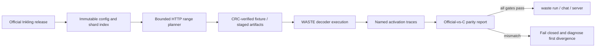
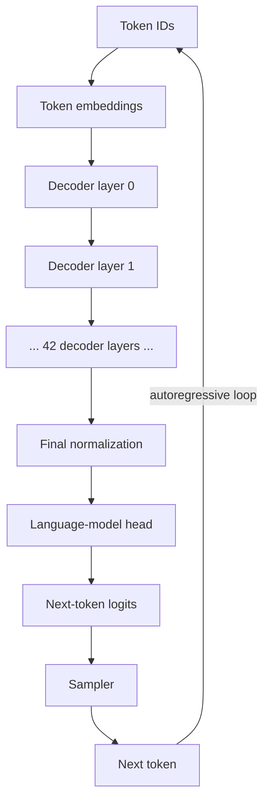
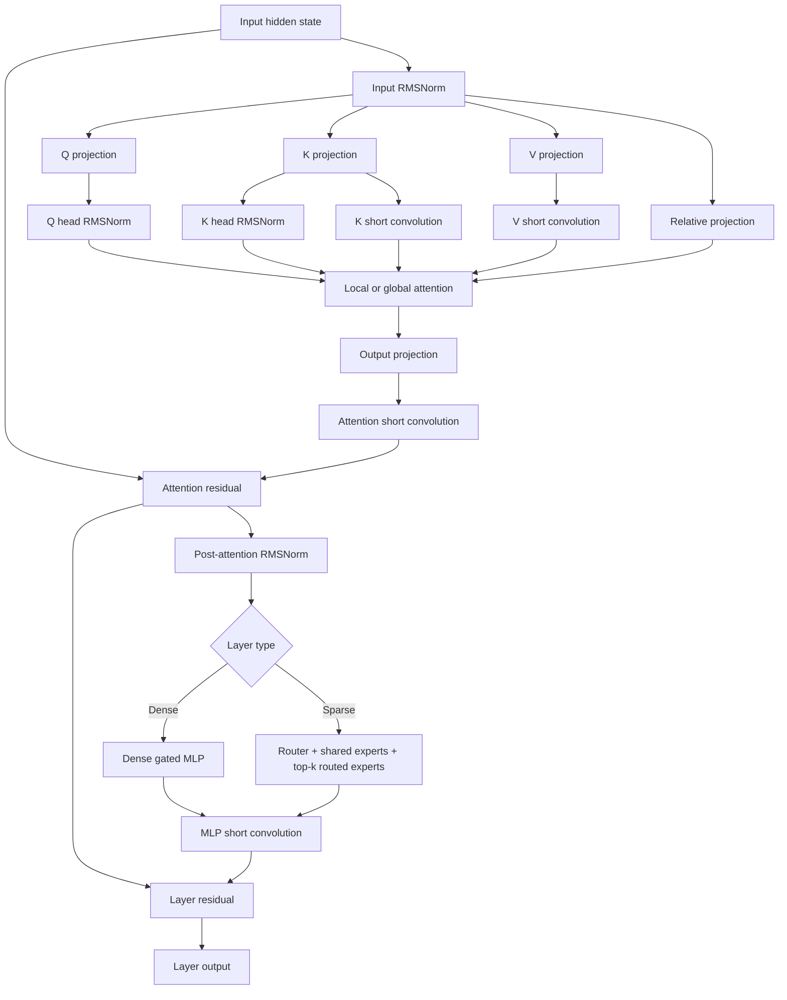
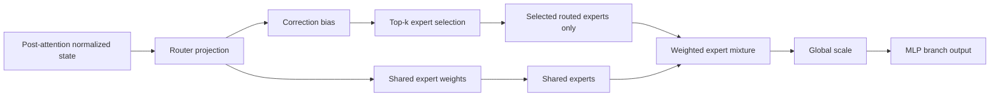
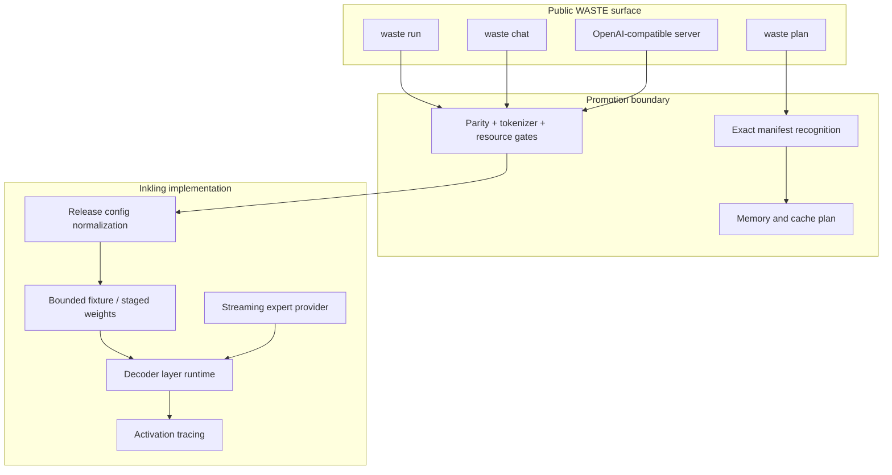

# WASTE × Inkling-Small

<p align="center">
  <strong>A bounded, evidence-first path to running a 276B sparse Transformer in WASTE.</strong>
</p>

<p align="center">
  
  
  
  
</p>

> [!IMPORTANT]
> `waste plan` supports Inkling geometry today. Public loading, generation, chat,
> and serving remain intentionally disabled until official-weight numerical
> parity, tokenizer/chat-template parity, and measured resource gates pass.

This repository develops Inkling-Small support for
[`sqliteai/waste`](https://github.com/sqliteai/waste): a portable C inference
runtime with explicit memory planning, fail-closed model recognition, and a
normal path to CLI and OpenAI-compatible serving.

The objective is not to make Inkling “appear to run.” The objective is to make
every architectural and numerical claim reviewable.

---

## The mission

Inkling-Small is a **42-layer decoder-only sparse Transformer** with roughly
**276B total parameters** and about **12B active parameters per token**. It
combines local and global attention, relative-position features, short
convolutions, dense feed-forward layers, and routed Mixture-of-Experts layers.

WASTE must therefore solve five distinct problems:

1. recognize the release and bind its geometry without guessing;
2. plan storage and RAM before touching hundreds of gigabytes of weights;
3. stream the selected tensors and experts without expanding the full model;
4. reproduce the official BF16 decoder semantics;
5. expose the model through ordinary WASTE APIs only after the evidence is green.



---

## Full model architecture

At the model level, Inkling follows the familiar autoregressive decoder shape,
but each decoder block may use a dense MLP or a sparse routed expert bank.



### One Inkling decoder layer



### Sparse expert path



The WASTE path never needs to allocate a zero-filled 256-expert resident bank.
Selected experts are served through the runtime’s `expert_get` callback, keeping
memory proportional to the experts actually required by the evidence fixture.

---

## How WASTE applies to Inkling

WASTE already supplies the operational shell a production model needs:

- cgroup-aware usable-RAM detection;
- explicit preflight memory planning;
- portable C build and server integration;
- cancellation, error propagation, and normal public APIs;
- a container format that can fail closed before loading tensors.

The Inkling work adds a model-specific architecture layer without creating a
second public runtime.



Today only the planning path crosses the public boundary. Execution APIs return
`WASTE_E_UNSUPPORTED` for Inkling until promotion gates are satisfied.

---

## Current status

### Landed on `main`

| Area | Evidence |
| --- | --- |
| Exact model recognition | Official Inkling-Small package is recognized; mislabeled or incomplete manifests are refused |
| Public memory planning | `waste_plan_memory()` and `waste plan` calculate the model geometry without loading weights |
| Config schema resolution | Release `dense_intermediate_size=16384` and routed `intermediate_size=2048` are translated safely into the Transformers schema |
| Synthetic architecture parity | Dense/local and sparse/global decoder layers match `InklingDecoderLayer` to float32 epsilon on bounded synthetic fixtures |
| Remote bounded extraction | Immutable HTTP range reads, source-hash binding, CRC checks, path validation, and strict byte limits |
| Official router evidence | Eight deterministic BF16 states record exact `(expert_id, weight)` pairs for layers 2 and 5 |
| Evidence-selected fixture plan | 175 entries, 3,842,395,658 payload bytes, 52 metadata/range requests, 25 touched shards |
| Sparse memory bound | Selected experts are supplied through `expert_get`; no full 256-expert float32 bank expansion |

The committed official selection contains **33 unique routed experts for layer
2** and **26 unique routed experts for layer 5** across the eight deterministic
positions.

### Completed in the active parity work

The official 532 GB checkpoint has **not** been run end to end, but bounded
official-weight execution has now crossed several important gates:

- the 3.58 GiB fixture was downloaded and CRC-verified;
- official and C execution completed for representative dense, local-sparse,
  and global-sparse layers;
- C route differences were shown to remain inside valid official BF16 cutoff
  ties, with attached weights below the `1e-3` comparison bound;
- canonical official routes were used to separate routing ambiguity from
  arithmetic drift;
- the first numerical mismatch was isolated to BF16 execution semantics rather
  than config, fixture, binding, or expert coverage.

### Still in progress

| Gate | Current boundary |
| --- | --- |
| Official-weight activation parity | Numerical drift remains; the first mismatch begins at BF16 RMSNorm / matrix boundaries |
| BF16 RMSNorm | Required cast-before-scale ordering has been identified in diagnostics, but production F32 behavior remains unchanged |
| BF16 matrix execution | Simple float32 or double accumulation plus output rounding does not reproduce every native BF16 GEMM threshold case |
| Dense and expert-path end-to-end parity | Must be rerun after a validated BF16 execution policy exists |
| Tokenizer and chat-template parity | Not yet promoted into the release gate |
| Quantized model quality | Q8/Q4/VQ tolerances, throughput, conversion time, and memory floors still require official measurement |
| Public loader and generation | Deliberately disabled |
| Native Windows and operator validation | Final release and serving gate |

---

## Evidence roadmap


The finish line is intentionally ordinary:

```text
waste plan model.waste
waste run model.waste
waste chat model.waste
waste serve model.waste
```

No Inkling-only executable, no hidden memory budget, and no separate serving
stack.

---

## Evidence artifacts

| Artifact | Purpose |
| --- | --- |
| [`docs/CONFIG-SCHEMA-RESOLUTION.md`](docs/CONFIG-SCHEMA-RESOLUTION.md) | Authoritative release geometry and schema translation |
| [`docs/REMOTE-FIXTURES.md`](docs/REMOTE-FIXTURES.md) | Strict HTTP range extraction and safety contract |
| [`docs/OFFICIAL-ROUTER-SELECTION.json`](docs/OFFICIAL-ROUTER-SELECTION.json) | Exact official routed expert/weight pairs for deterministic inputs |
| [`docs/OFFICIAL-FIXTURE-PLAN.json`](docs/OFFICIAL-FIXTURE-PLAN.json) | Hash-bound 3.58 GiB evidence fixture plan |
| [`docs/MVP-READINESS.md`](docs/MVP-READINESS.md) | Current handoff and next execution gate |
| [`docs/STATE-OF-THE-PORT.md`](docs/STATE-OF-THE-PORT.md) | Broader audit of the WASTE integration |
| [`docs/CODEBASE-MAP.md`](docs/CODEBASE-MAP.md) | Translation units, tools, tests, and generated bundle flow |
| [`docs/ROADMAP-V19.md`](docs/ROADMAP-V19.md) | G0–G6 promotion roadmap |

---

## Repository layout

```text
inkling/                     source of truth: C runtime, tools, tests, design
mvp/                         bounded official-reference and evidence harnesses
integration/waste/           upstream pin, overlays, generation, verification
dist/waste-inkling-6931570/  generated and checksummed patch bundle
docs/                        architecture, evidence, audit, and roadmap
waste-inkling-patch-v16..18/ frozen provenance and historical audit trail
```

Edit `inkling/`, not the generated patch bundle. The integration verifier
regenerates the bundle, applies it to the pinned WASTE tree, and checks that the
resulting Git tree is the reviewed tree.

---

## Reproduce the bounded evidence

### Run every G0 evidence test

```sh
python3 -m pip install torch 'transformers==5.14.1'
PYTHONPATH=mvp python3 -m unittest discover \
  -s mvp -p 'test_inkling_*.py' -v
```

### Reproduce the official fixture plan

```sh
experts="$({
  python3 - <<'PY'
import json

selection = json.load(open("docs/OFFICIAL-ROUTER-SELECTION.json"))
print(";".join(
    f"{layer}:{','.join(map(str, data['selected_experts']))}"
    for layer, data in sorted(
        selection["layers"].items(), key=lambda item: int(item[0])
    )
))
PY
})"

python3 mvp/inkling_remote_fixture.py \
  --revision 21152b5312c653be115f33a8342759064144e281 \
  --layers 0,2,5 \
  --experts "$experts" \
  --max-total-gib 4 \
  --plan-only
```

The resulting plan must match
[`docs/OFFICIAL-FIXTURE-PLAN.json`](docs/OFFICIAL-FIXTURE-PLAN.json), including
source hashes, selected entries, byte counts, requests, and shard set.

### Validate the WASTE patch bundle

```sh
integration/waste/verify.sh /tmp/waste
```

### Apply the generated bundle manually

```sh
git clone https://github.com/sqliteai/waste.git
cd waste
git checkout 69315701f634648f7a790915a0a525ed8aabf218
git am /path/to/dist/waste-inkling-6931570/patches/0001-Add-the-Inkling-Small-runtime-foundation-to-WASTE.patch
PATH=/usr/bin:/bin make check
```

Verify the bundle before applying it:

```sh
cd /path/to/dist/waste-inkling-6931570
sha256sum -c SHA256SUMS
```

---

## Development principles

### Fail closed

A missing field, wrong release, unsafe path, ignored HTTP `Range`, missing
expert, mismatched source hash, or failed activation comparison is an error—not
a default.

### Bound the work

The official model is hundreds of gigabytes. Every diagnostic must state the
layers, tensors, experts, byte budget, and source revision it needs.

### Separate evidence from production behavior

Diagnostics may patch a temporary source tree or substitute canonical routes.
They must never silently change the checked-in F32 runtime or claim public
support.

### Promote one gate at a time

Planning is public because its geometry is tested. Inference is not public
because official-weight numerical parity is not yet green.

---

## Current foundation

The integration targets:

```text
sqliteai/waste@69315701f634648f7a790915a0a525ed8aabf218
WASTE 0.6.3
public API version 1
container format version 0
```

The generated bundle and historical patch directories are provenance. The
reviewable implementation lives in `inkling/`, while the official evidence
harnesses live in `mvp/`.

> **The standard for promotion is not “plausible output.”**
>
> It is a model that plans honestly, loads within its declared budget, matches
> the official architecture and numerical behavior, and enters WASTE through
> the same boring public APIs as every other supported model.
